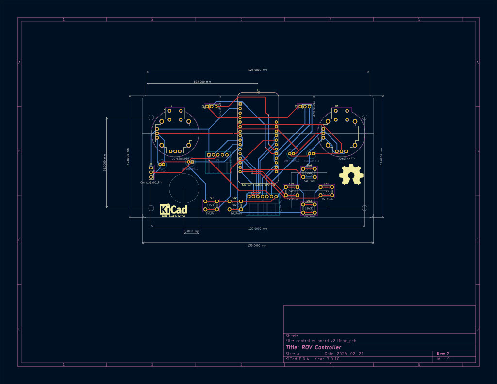

# Custom ROV Controller

###### What is this project?

I designed this controller as a combination of work project and learning tool

The original genesis of this project was a whacky controller thought up during many long hours of driving with myself and a co-worker. I decided to build a custom ROV controller based on a guitar hero controller for laughs. The controller was a lot easier to build than I thought it would be and it was a very fun thing at my work Christmas party. 

The Guitar hero controller utilized all the buttons used by default on the guitar, I had to add a linear Potentiometer for the vertical propellor as well as the "whammy bar" as a self centering vertical propellor controller. I also added the joystick to the guitar. This was a fun project and while I did learn some stuff about circuit python I defiantly did not plan to use this for more than a gag.

#### The Real Controller

This controller was designed for use with a video ray pro4 ROV as a more comfortable and normal user interface device.

 I work at a company that uses a pro4 to inspect submerged structures. I found that the default controller from Video Ray is really uncomfortable to use for a full day and its design made it difficult for me to use during complex movements and actions. The  original controller (seen below)  shows up as a USB game-pad to the laptop that is used to communicate with the ROV. This computer uses windows 10 and using the USB controller utility included in windows I was able to map out how the video ray controller button map is seen by the system. From what I understand the pro4 has two compatible controllers, the normal industrial controller that my company normally uses and also the Logitech Cordless RumblePad 2 which is an old controller. Apparently you can edit xml files to make other controllers work with the pro4 but as engineering support has ended for this bot, I was left with the options of editing xml files that could potentially make my pro4 console unusable if i did something wrong (not an option as this is a work machine), download software to  remap the controller using software (This option was unappealing because I found this kind of software to be really hit and miss for the functions that I needed to setup) or design my own custom controller. 

I learned to use KiCAD 7.0 to design the custom PCB for this project. I have dabbled with electronics and code for years and have made several custom breadboards but the step to making my own distinct PCB was really interesting. the community around KiCad was very good for a beginner to learn and once I started to understand the structure of the program and the workflow the process began to make a lot of sense. I did do two different versions of this board. with the first version I was manually routing traces between my components and I realized that that was going to take way too long and for this application it didn't make much sense so I ended up auto routing the rest of the project. This worked fine though I do think that there are defiantly routing things I could have improved.

 I also did not know how PCB manufactures price out boards based on the amount of area that each board will take up in the batching process. Because of these things I found that I could save a bunch of money by making two distinct boards with one being the primary controller and the other being used for the shoulder buttons. the shoulder button board breaks in half for each side of the controller and everything is "wired" up really simply. I think adding an I2C analog input expansion board would have been a useful addition for this board (more on that later). I used OSH Park ~ for my PCB manufacturer because it was super easy to upload my KiCAD files to get them manufactured and the quality seems to be very good of the received circuit boards.

and I used OnShape for the design of the body of the controller. I took a fairly simple approach to this and imported all the boards and as many components as i could find models for and built an assembled circuit board in an assembly. from there I used dimensions of the board to layout the base of the controller. From there I designed the front plate as a piece used to hold the shoulder buttons. the shoulder buttons are a bit rough admittedly, I considered a bunch of different ways of designing the buttons and I think the method I used is ok if I had executed it a bit better. If I were to do a full redesign I would probably do something more similar to paddles instead of the straight push buttons I ended up with. Lastly I designed the face plate of the controller based off the PCB assembly I had built before. Onshape has a really neat feature that allows for referencing assemblies in a part design workflow. this was really handy for designing parts in reference to other more complicated items. 

.png)

.png)

.png)

The CAD for this project is available in the 3d Models folder for both .step files and .3mf files. To view, copy and mess around with my original cad models checkout the below OnShape link.

https://cad.onshape.com/documents/9419f7314355fc0529143749/w/7dd750f9077cb0f159653e8e/e/9448de140bcc603a1d0b7df0

###### The electronics used

- RP2040 Adafruit Feather board

- with generic joysticks bought on digikey (COM-09032),

-  10 generic push buttons (6mm button height),

-  4 electrolytic capacitors to smooth joystick motion (47 Farad) 

- 1 10k linear POT. 

- an assortment of DuPont headers

###### The code!

The code for this project relies heavily on an awesome library called 
joystick_XL for circuit python. if you want to build a project like this one a great starting point is this GitHub and associated documentation.

 [GitHub - fasteddy516/CircuitPython_JoystickXL: Turn a CircuitPython device into a joystick controller with lots of inputs.](https://github.com/fasteddy516/CircuitPython_JoystickXL) 

I also ended up using some logic to switch inputs from a joystick on the right side to the potentiometer in the middle of the controller. This switch is useful because I found that I wanted a self centering vertical thruster control. For the Pro4 this means that when you are not actively using the controller the vertical propellor will be off. We set the pro4 to be neutrally buoyant when in fresh water. If you want to use the vertical propellor when not actually touching the controller (very useful for certain actions, motions and when lifting on items during an inspection). 

For those unfamiliar with the somewhat complicated process of building a USB HID device this library and circuit python in general makes things really easy. I can see lots of use cases for this library with all manner of custom interface devices and I could see this project acting as a good starting point for anyone trying to do something similar.

For anyone trying to replicate this project 1 to 1 for use with a pro4 I have been using this device for the last couple days and I have some things I would like to revise. I don't plan on doing that unless there is more interest in this project beyond just me. 

Please reach out to me if you want to build or use this project with your own Video Ray device as this thing in its current state could use some modification for that. If your from video ray and your reading this, I tried asking your support for help mapping an Xbox controller for use with my bot but I was told that there's no longer tech support 
for this older ROV. I have no intention of selling or mass manufacturing this thing as a pro4 controller but there may be other uses for a custom ROV controller or even a specially built windows gamepad. 

###### Lessons Learned and things to improve

- I should have used a micro controller with one additional analog input pin. this would have added flexibility for modifying the controller config. I find that I want to use the left hand controller for vertical movement and also for yaw and using the right stick for going forward and back. The current controller doesn't have the Y axis on the left hand stick connected to anything currently because I had to have the set and forget vertical propellor as an option. I think next time I would use something more like the Adafruit Feather M4 Express as it would have enough digital pins and enough analog IO to get the job done. this micro controller is a bit more spendy and I could also see using the Adafruit Feather 32u4 as a cheaper alternative. Basically something with the same pinout and more analog pins while still having at least 12 digital pins onboard. 

- The shoulder buttons are not very good. I think I could have planned those better and I think that next time I would use something more like a standard keyboard switch for the shoulder buttons or something like a simple paddle that would push on the head of a simple button. 

- I would like to explore a wireless version of this device at some point but this is pretty far down my list of priorities. 

